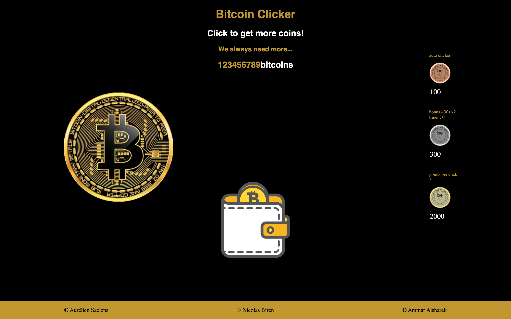

# Bitcoin Clicker :

## Langage used : 

* HTML 
* CSS
* JavaScript

---

* ## Rules : 

1. Base structure : 

    Write the base structure for the project in HTML, CSS and JavaScript. Within the HTML, put a click button which will increment a counter and a label initialised at 0 to display said counter.

2.  Prepare the JavaScript :

    In your JavaScript prepare variables to allow you to control your button and label. You will also need a variable to keep track of the score.

3. Increase the score :

    When you click the button, increase the variable storing the score by 1, then display the current score inside the label.

4. Make a multiplier :

    Add another button which will act as a multiplier. When called this button will permanently multiply the number of points per click, by two for example.

5. Price of multiplier :

    The multiplier allows you to have a big score quickly, that shouldn’t be free, it should be a purchase made with the current player score.

6. No credit :

    You can’t make credit, meaning that the player cannot have a negative score. Think about updating the score display after a purchase.

7. Display multiplier counter :
 
    Display the counter within the multiplier. For example, if the counter is worth 5, then the button should display something like multiplier x5.

8. Increase the cost :

    Buying a lot of multiplier is way too easy. For more fun, make it so that each time a multiplier is purchased the cost of buying a new one is increased.

9. Display the cost :

    In the text of the multiplier button you should also have the price of the upgrade.

10. Auto-clicker :

    Implement a new improvement to buy, the auto-click. As the name might suggest this bonus will automatically add a click to your score each x seconds.

11. Bonus :

    Implement yet another improvement to buy, the bonus. It should grant the player a boost in score of 200% per click for 30 seconds. When purchased the player should see a timer with the remaining time inside the bonus button.

12. Deactivate the buttons :

    Make it so that, if the player doesn’t have the points to purchase a multiplier, an auto-click or an other bonus, he can’t.

13. Make it pretty!!

---

## Evaluation criterias :

| Criteria       | Indicator                                                    | Yes/No |
| -------------- | ------------------------------------------------------------ | ------ |
| 1. Is complete | The student has realized all must-have features.             |        |
|                | There is a published GitHub page available.                  |        |
|                | The readme is complete                                       |        |
| 2. Is Correct  | The HTML and CSS pass the W3C Validation tool.               |        |
|                | The lighthouse test scores 90 at least on Performance,       |        |
|                | Best Practices, Accessibility and                            |        |   
|                |   The indentation is perfect                                 |        |

---

## Sources : 

* [Youtube](https://youtube.com)
* [Grafikart](https://grafikart.fr)
* [MDN](https://developer.mozilla.org)
* [Stack Overflow](https://stackoverflow.com)
* [W3 Schools](https://w3schools.com)

---

## The team :

- [Aurélien Saelens](https://aureliensaelens.github.com)
- [Nicolas Biren](https://github.com/birennicolas)
- [Ammar Alsharek](https://github.com/Alsharek)

---

## Preview : 

